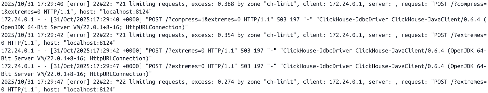
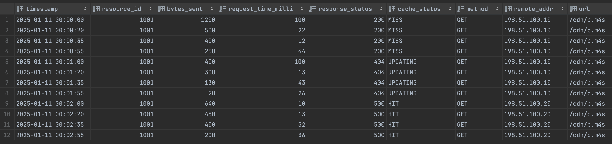
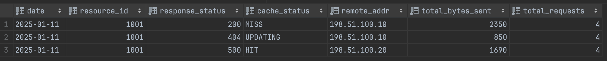

# README.md
## Obsah
- [Úvod](#úvod)  
- [Cap'n Proto dekódování](#capn-proto-dekódování)  
- [ClickHouse](#clickhouse)  
  - [Propojení Javy s ClickHouse](#propojení-javy-s-clickhouse)  
  - [Proxy limitace požadavků](#proxy-limitace-požadavků)  
  - [Ukládání dat do databáze](#ukládání-dat-do-databáze)  
  - [Agregační tabulka](#agregační-tabulka)  
    - [Splňuje tato tabulka očekávání?](#splňuje-tato-tabulka-očekávání)  
    - [Odhad požadovaného místa na disku](#odhad-požadovaného-místa-na-disku)  
    - [Doba uchování agregovaných dat](#doba-uchování-agregovaných-dat)  
- [Co by šlo udělat lépe](#co-by-šlo-udělat-lépe)  
  - [Nedostupnost databáze](#nedostupnost-databáze)  
  - [Duplicitní záznamy](#duplicitní-záznamy)  
- [Závěr](#závěr)  

## Úvod
Zadání: [Anonymizer](task.md)

Téma Anonymizer jsem si vybral převážně z důvodu, že Kafka a monitoring služby pro mě nebyly cizí a již jsem se s nimi setkal v mém předchozím [projektu](https://github.com/thephenom00/SIS-Microservices-Project). Nicméně i přes zvolenou „cestu nejmenšího odporu“ jsem se s mnoho požadovanými technologiemi setkal v tomto tasku zcela poprvé. 

Z nabízených programovacích jazyků pro implementaci jsem zvolil Javu především protože v ní mám největší zkušenosti a výhodou je také, že se jedná o nativní jazyk pro Kafku.

V následujících sekcích si postupně probereme jednotlivé části celého řešení a popíši jejich implementaci a problémy se kterými jsem se setkal.

## Cap'n Proto dekódování
Jelikož je kompilátor pro Cap'n Proto napsán v jazyce C++, musel jsem najít vhodnou alternativu pro Javu. Naštěstí exituje knihovna [capnproto-java](https://github.com/capnproto/capnproto-java/), pomocí které jsem ze schématu [http_log.capnp](capnp/http_log.capnp) vygeneroval třídu `HttpLog`. Tu jsem následně použil pro dekódování zpráv přijatých z Kafky.

## ClickHouse
Po dekódování a transofrmaci dat dle zadání (změny posledního oktetu na `X`) následovala největší výzva celého tasku - uložení dat do ClickHouse databáze. Bylo nutné vyřešit několik specifických úkolů: propojit Javu s ClickHouse databází, vypořádat se s rate limitem 1 request za minutu a vytvořit novou tabulku tak, aby umožňovala rychlé a efektivní dotazování. 

### Propojení Javy s ClickHouse
Mou první myšlenkou bylo použít standard **JPA (Java Persistent API)**, který se ale po krátkém researchi jevil jako neoptimální řešení. Důvodem bylo, že JPA je primárně navržen pro databáze typu **OLTP (Online Transaction Processing)**, čili relační databáze orientované na řádky, kde se převážně pracuje s relativně malým objemem dat, které jsou často aktualizované.

Nicméně v případě ClickHouse se jedná o **OLAP (Online Analytical Processing)** databázi, která je optimalizovaná pro práci s velkým množstvím dat a jejich hromadným ukládáním. Proto jsem tedy použil JDBC ovladač `clickhouse-jdbc`, který doporučuje i samotná ClickHouse [dokumentace](https://clickhouse.com/docs/integrations/language-clients/java/jdbc).
### Proxy limitace požadavků
Následovala část, která mi osobně dala zabrat zdaleka nejvíce. Dle zadání musela aplikace komunikovat s ClickHouse pouze skrze **nginx proxy**, která má nastavený limit **1 request za minutu**.

První problém nastal, když jsem se pokusil vložit do databáze pouze jeden záznam. K žádnému vložení nedošlo a důvodem bylo to, že spolu s INSERT dotazem, bylo vygenerováno několik dalších dotazů, konkrétně `POST /?extremes=0` a `POST /?compress=1&extremes=0`. Tyto dotazy se poslaly dříve než samotný INSERT a tím pádem se žádná data neuložila.

Předpokládal jsem, že se tyto dotazy posálají automaticky spolu s každým dotazem a jedná se např. o načtení samotné tabulky než se do ní uloží data. Ukázalo se však, že to byla mylná domněnka, jelikož ani po navýšení limitu requestů žádná změna nenastala a především po zkontrolování logů v Dockeru se ukázalo, že se tyto requesty posílají v pravidelných intervalech.



Zjistil jsem, že se jedná o **health check** dotazy, což by také vysvětlovalo proč se posílaly v pravidelných intervalech. Napadlo mě překonfigurovat proxy tak, aby se rate limit aplikoval na všechny dotazy kromě těchto healthcheck dotazů. Takové řešení ale už z principu není vhodné a ocitl jsem se na chvíli ve slepé uličce.

Po několika hodinách trial and error jsem nakonec zjistil, že zakopaný pes byl úplně jinde než jsem očekával. Používal jsem totiž zastaralou verzi `clickhouse-jdbc` ovladače a prostá změna na novější verzi vše vyřešila, jelikož v novější verzi již aplikace neposílala health check dotazy.

### Ukládání dat do databáze
Nyní, když už jsem byl schopen ukládat data do databáze, bylo nutné zvolit vhodný způsob jak tyto data ukládat v dávkách, nikoli jednotlivě jeden po druhém, abych se vypořádal s nastaveným proxy limitem.

Každý záznam se tedy po dekódování uloží do fronty typu `ConcurrentLinkedQueue`, která zajišťuje bezpečný přístup z více vláken. V pravidelných intervalech po `65 sekundách` se aplikace poté pokusí uložit veškerá data z fronty do databáze, přičemž pětisekundový rozdíl oproti limitu slouží jako malá rezerva.

V případě, že se zápis nepovede, data se jednoduše vrátí zpět do fronty a pokusí se uložit při dalším pokusu.

### Agregační tabulka
Uložením dat do databáze proces nekončí a bylo třeba zajistit rychlé a efektivní dotazování na tyto data, ideálně v řádu několika sekund.

Pro tento účel jsem vytvořil tabulku `http_log_total_traffic`, která využívá engine `SummingMergeTree`. Tento engine je oproti standardnímu MergeTree speciální v tom, že automaticky provádí součty číselných sloupců (v našem případě `total_bytes_sent` a `total_requests`) při slučování záznamů, díky čemu dosáhneme mnohem rychlejší odezvy při čtení dat. 

Tabulku jsem dále rozdělil na partition, což umožňuje data ukládat do bloků dle určitého klíče (v našem případě datum). Pokud dotaz obsahuje filtr na nějaké časové období, ClickHouse nemusí procházet celou tabulku řádek po řádku, ale pouze vybraný blok odpovídající tomuto datu.

```
CREATE TABLE IF NOT EXISTS http_log_total_traffic
(
  date                Date,
  resource_id         UInt64,
  response_status     UInt16,
  cache_status        LowCardinality(String),
  remote_addr         String,
  total_bytes_sent    UInt64,
  total_requests      UInt64
)
ENGINE = SummingMergeTree((total_bytes_sent, total_requests))
PARTITION BY toYYYYMM(date)
ORDER BY (date, resource_id, response_status, cache_status, remote_addr);
```

Aby se do této nově vytvořené tabulky ukládala data automaticky, bylo třeba vytvořit `MATERIALIZED VIEW`. Ten po vložení každého záznamu do standardní tabulky `http_log` data přepočítá a zapíše do tabulky `http_log_total_traffic`.

```
CREATE MATERIALIZED VIEW http_log_materialized_view  
TO http_log_total_traffic  
AS  
SELECT  
  toDate(timestamp) AS date,  
  resource_id,  
  response_status,  
  cache_status,  
  remote_addr,  
  sum(bytes_sent) AS total_bytes_sent,  
  count() AS total_requests  
FROM http_log  
GROUP BY date, resource_id, response_status, cache_status, remote_addr;
```

Zde je ukázka původní tabulky `http_log` a výsledná agregovaná tabulka `http_log_total_traffic`.




#### Splňuje tato tabulka očekávání?
Převedeme-li to na příklad v reálném provozu, pak v případě tisíců serverů a desítky tisíc unikátních IP adres může jít o miliony záznamů za hodinu.

Z principu věci by agregovaná tabulka měla být nejhůře stejně efektivní jako původní nezměněná tabulka, jelikož jeji velikost není narozdíl od první tabulky závislá na objemu dat, ale pouze na počtu unikátních kombinací `date`, `resource_id`, `status`, `cache_status` a  `remote_addr`.  

Bez Materialized View by tedy v našem případě dotaz typu `GROUP BY ... WHERE timestamp > now() - interval '1 day'` procházel miliony a miliony záznamů, což by mohlo trvat vteřiny až minuty.

Stejný dotaz by v případě agregované tabulky zabral pouze zlomek tohoto času a odpověď by přišla v řádech milisekund.

Je však potřeba dodat, že v tomto jednoduchém a málo komplikovaném případě může být tento způsob optimální, nicméně v mnohem komplexnějším systému by bylo třeba se hlouběji zamyslet a vzít v potaz **indexace** nebo efektivnější **partitioning**.

#### Odhad požadovaného místa na disku
Pro tento odhad budeme muset vypočítat velikost 1 záznamu v tabulce:
- **`timestamp`** (DateTime): 4 B
- **`resource_id`** (UInt64): 8 B
- **`bytes_sent`** (UInt64): 8 B
- **`response_status`** (UInt16): 2 B
- **`cache_status`** (LowCardinality(String)): ~1 B
- **`method`** (LowCardinality(String)): ~1 B
- **`remote_addr`** (String): ~12 B
- **`url`** (String): ~100 B

Celkem tedy průměrně **1 záznam ≈ 150 B**.

Označíme si proměnné pro odhad celkového místa:
- **`D`** = požadované místo na disku
- **`R`** = průměrná rychlost zpráv (messages/sec)
- **`S`** = průměrná velikost jedné zprávy po uložení (v našem případě 150B)
- **`T`** = doba uchování surových dat (v sekundách)

Rovnice pro odhad tedy bude následující: 

```
D = R * S * T
```

**Příklad pro malou službu:**
- 1 producent
- Průměrná rychlost zpráv: 100 zpráv/sec
- Doba uchování: 1 den = 86 400 s

```
D = 100 * 150 * 86600 = ~1,3GB
```

**Příklad pro větší službu s více producenty:**

V případě větší služby, přichází do hry více producentů. Počet producentů označíme jako **`N`** a průměrnou rychlost zpráv všech producerů **`R_p`**.

V konkrétním případě kdy zvolíme následující parametry:
- 3 producenti
- Průměrná rychlost zpráv producentů: 300 zpráv/sec
- Doba uchování: 1 den = 86 400 s

Bude celkové požadované místo na disku:

```
D = 3 * 300 * 150 * 86600 = ~11,7GB
```

#### Doba uchování agregovaných dat
Na dobu uchování dat by se dalo pohlížet 2 způsoby. Jedním z nich je právní a druhý technický.

**Právní a obchodní pohled**

Zde by záleželo, zda-li anonymizace, kterou jsme provedli je dostatečné a splňuje podmínky GDPR. Podle toho by se určovala maximální doba, po kterou je možné data uchovávat. 

Zálěží také na interních potřebách firmy samotné. Ta musí rozhodnout jak dlouho zpětně by své logy chtěla uchovávat.

**Technický pohled**

Jakmile bychom znali odpověď na dobu po kterou chceme data uchovávat, ClickHouse nabízí velmi jednoduché a elegantní řešení, jak data z tabulek odstranit. Využil by se `TTL (Time To Live)`, který bychom velmi jednoduše přidali při vytvoření agregované tabulky.

```
CREATE TABLE IF NOT EXISTS ...
(
  date        Date,
  ...
)
...
TTL date + INTERVAL 1 YEAR DELETE;
```

Další myšlenkou co mě napadla, bylo využít koncept `Hot/Cold storage`. Jedná se o to, že bychom "cold" data, čili např. data starší 3 měsíců přesouvali na levnější, více dostupná úložiště. Na tyto data by byly tím pádem pomalejší dotazy, nicméně to by v případě, že s nimi  pracujeme pouze zřídka nebyl problém. Z těchto levnějších úložišť by se následně také mohlo provádět pravidelné mazání např. 1x ročně.

## Co by šlo udělat lépe
### Nedostupnost databáze
Jak jsem již zmínil v kapitole [Ukládání dat do databáze](#ukládání-dat-do-databáze), v případě, že by nebylo možné data uložit, přidají se zpět do fronty a aplikce se pokusí o uložení v dalším intervalu.

Tato implementace však selhává, pokud by databáze nebyla dostupná po delší dobu (např. při výpadku). V takovém případě by se aplikace neustále pokoušela uložit data, ale vždy by došlo k neúspěchu, což by mohlo vést k zahlcení systému.

Jedním z řešení by mohlo být zavadení counteru neúspěšných pokusů a v případě, že by se data po řekněme 5ti pokusech uložila do jiné databáze, která by se vždy při spuštění synchronizovala s produkční databází.

Podíváme-li se na tento problém z trochu jiného pohledu, za zmíňku rozhodně stojí i implementace Circuit breakeru. Ten by po X neúspěšných pokusech přestal dotazy posílat dál a zabránil by tak přehlcení služby.

### Duplicitní záznamy
V případě, že by došlo k chybě a nějaký záznam byl v Kafce uložen více než jednou, je možnost pří návrhu tabulky využít engine `ReplacingMergeTree`. Ten by automaticky nahradil starší záznam novějším, dle specifického sloupce.

## Závěr
V první řadě bych rád poděkoval, že mi byla vůbec poskytnuta možnost tento task vypracovat a tím ukázat své znalosti na reálném typu problému se kterým bych se při práci v CDN77 mohl setkat. 

Doufám, že jak způsob přemýšlení jak bych dané problémy řešil, tak i samotná implementace Vás přesvědčí o tom, že jsem pro Váš team dobrý match. Věřím také, že je tu stále obrovský prostor pro zlepšení a jsem připraven na sobě dále pracovat.

Samotný task mě velmi bavil a setkal jsem se v něm s mnoho novými technologiemi, které mi rozšířily můj obzor. Vážím si velmi dobře zpracovaného zadání a připraveného docker-compose, který mi velmi usnadnil práci při testování aplikace.

Děkuji za Váš čas a budu se těšit na zpětnou vazbu.
